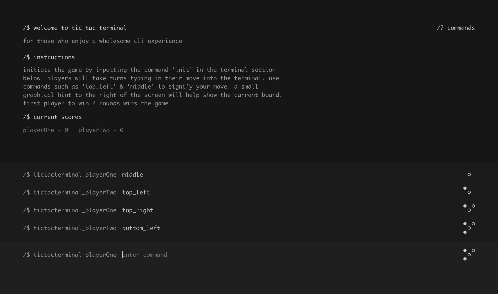

# tic_tac_terminal
**For those who enjoy a wholesome cli experience.**

### Initiate Gameplay Here
https://tayteboss.github.io/tictacterminal/

## Instructions
Initiate the game by inputting the command ‘init’ in the terminal section. Players will take turns typing in their moves into the terminal. Use commands such as ‘top_left’ & ‘middle’ to signify your move. A small graphical hint to the right of the screen will help show the current board. Click the 'commands' button towards the top right of the screen for a list of all valid commands. First player to win 3 rounds wins the game.

## Concept
My overall concept of the theme was the rethink the way we normally play the classic game tictactoe. After learning about the terminal and the CLI to navigate the computer, I wanted to emulate this experience for the game. 

Throughout the design stage I wanted to remove as many of the graphical elements as possible and utilise typography as the crux of the gameplay experience. Taking references from the the terminal application, I've emulated the typefaces and the overall 'dark theme' to make the game look like a cli application.

The user experience of the game is what makes this project most interesting. Instead of relying on a tictactoe visual board, I wanted players to look at the history of the past moves and visually interpret the current board in their minds. This experience in turn leads to higher level thinking and more opportunity for mistakes during the game.

## Technology & Concepts used
* HTML 5
* CSS 3
* BEM CSS
* SASS
* Javascript
* JQuery Animations
* SVG Animations

## Challenges
### Structuring Data
At the start of the build I struggled quite a bit with working out how to structure the data I would need to use throughout the program. I think this could have been alleviated if I wrote more puesocode before starting to code out structures. A lot of these issues were worked out through trial & error (failing fast).

### Duplicating Code
For someone that gets quite anxious about code duplication. I found myself constantly duplicating code for each player. By the end, I figured out some ways of creating generic functions for both players, however, there's still some instances in need of refactoring. 

### Flow Control
Flow Control seemed to be reoccuring problem throughout this process. Again I think these issues could have been alleviated if I wrote more puesodocode at the start of the project.

### Variable Naming
Towards the end of the build I struggled to work out what some variables were at a glance. I had to refactor quite a few variable names to make more sense of what the code was doing at a glance.

## WIP
* Not allowing any other commands beside 'init' at the begginning of the game.
* Audio for the landing screen.
* Refactoring Code.